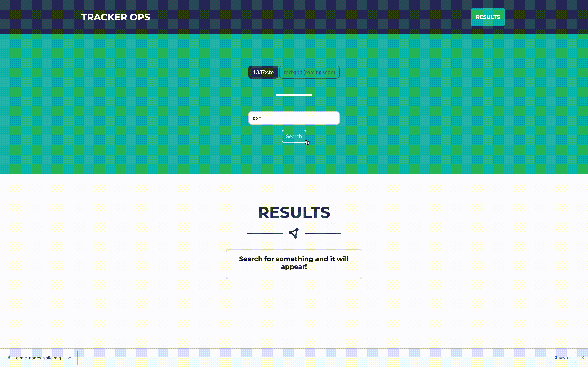

# Tracker Ops

A proxy service to search trackers (currently only 1337x.to) without
ads, popups and through a unified sleek UI.

Also, a proxy service for Deluge, since the standard web ui is old, ugly
and lacks features like proper search and filtering.

The idea for this came out of necessity, as trackers were blocked on my work station, 
luckily I have a NAS, which actually runs deluge, so here we are.

## Implementation

### Tracker search
Search keywords are sent to the BE, which sends them to the selected tracker and parses the response. 
Adding torrents directly to the deluge server is supported, since magnets are sometimes tricky
with a NAS setup.

### Deluge UI
The FE opens a socket, which triggers the BE to connect to Deluge at the url specified in `application.yml`.  
A publisher channel coroutine starts, which sends requests to deluge every second for 15 minutes.
The channel consumer sends the received torrents through said socket to the UI.

On tab close the FE closes the socket and the BE closes the channel.

#### Mutations

Filtering and search is done through `Mutation`s of an immutable `state`.  
`Mutation` is SAM that mutates the `state` and returns a new one.
There's only one state - no users, no sessions etc.

Each mutation is run sequentially on the result of the previous, so a `Search` within a `Search` is possible,
as well as combining several `Sort`s - one after the other. 

This might be overkill and useless, but whatever.

# Showcase

